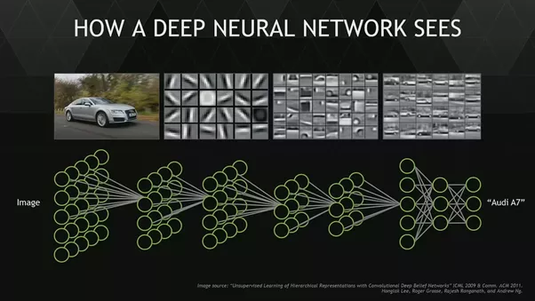
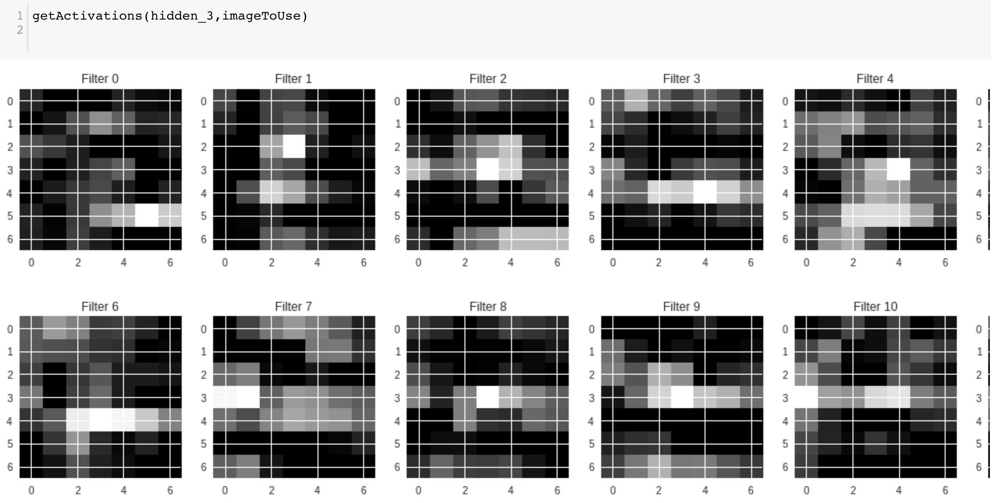

# ADS Project 5: 



#### PPT: [https://prezi.com/view/aLMlzVDt2iJCiDe1n1hn/](https://prezi.com/view/aLMlzVDt2iJCiDe1n1hn/)

Term: Fall 2018

+ Team #4
+ Projec title: Convolutional Neural Network Feature Visualization
+ Team members
	+ Li, Shilin sl4261@columbia.edu
	+ Xu, Zhengyang zx2229@columbia.edu
	+ Yang, Mingyu my2545@columbia.edu
	+ Yu, Chenghao cy2475@columbia.edu
	+ Yue, Yang yy2826@columbia.eduember 2
	
## Project summary:

We choose this project because neural networks as black box function approximators, most people are not sure how each layers are doing their jobs. 

Therefore, We want to explore what and how exactly different layers are extracting features. In this way, we will have a better understanding of different layers in CNN. 

The project has 3 parts. The 1st part we are using mnist dataset and build a straightforward 3-layer CNN. We then visualize the filtered channel from each layer. The 2nd part we are looking at practical images. The process is trained a CNN model with respected to dogs and cats classification. The goal of the visualization is exploring how the CNN is learning a cat. The 3rd part is using the popular VGG16 model and visualizing the filter in each layer. Therefore, we not only could explore the output from the CNN convolutional layer, but also get some knowlege of the CNN filters.

1. **MNIST Feature**

We created a basic 3-layers CNN for MNIST dataset, and visualized each layers' features. We can look at how that image activates the neurons of the first convolutional layer. We notice that each filter has learned differently to activate optimally for different features of the image. Also, as layer increases, the images which activate feature optimally will be less clear than previous layers'.


First Layer |
:-------------------------:|
|

Second Layer|
:-------------------------:|
|

Third Layer|
:-------------------------:|
|

3. **Learning a Cat**


4. **Explore Filters from VGG16**

First Layer             |  Second Layer
:-------------------------:|:-------------------------:
  |  
Third Layer             |  Forth Layer
  | 


4. **Conclusion**:
	+ Shadow layers extract the texture and details characteristics.
	+ Deeper layers extract the outline, shape and strongest features.
	+ Shadow layers includes more features and also has the ability to extract the key features.
	+ Comparably, the deeper the layer, the more representative of the features extracted.
	+ Resolution of images decrease as the layers go deeper.


## Contribution statement:  

**Li, Shilin**: Programmed the Mnist CNN model and visulize the mnist dataset on the layer base. Coded on the cat and dog classification, and write the visualization function to explore the feature extracted from each channel. Summarize the feature differences for the CNN learning process.

**Xu, Zhengyang**: Trained the classification model in cats & dogs dataset. Programmed on visualizing each filter from each layer of the VGG 16 model. Coded on the heatmap in explore the contrast area when CNN is doing classification. 

Yang, Mingyu: Summerized the output feature differences and assist on the presentation.

**Yu, Chenghao**: Researched on the feature visualization from various sources and provide important insight in building models and visualize the CNN output.

Yue, Yang: Write a conclusive summary pdf of the jupiter notebook. Created the PPT and organize the presentation structure.

Following [suggestions](http://nicercode.github.io/blog/2013-04-05-projects/) by [RICH FITZJOHN](http://nicercode.github.io/about/#Team) (@richfitz). This folder is orgarnized as follows.

```
proj/
├── lib/
├── data/
├── doc/
├── figs/
└── output/
```

Please see each subfolder for a README file.
