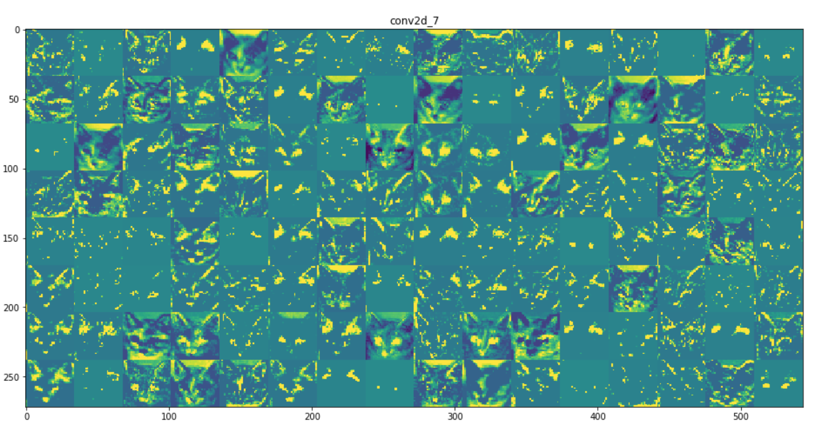
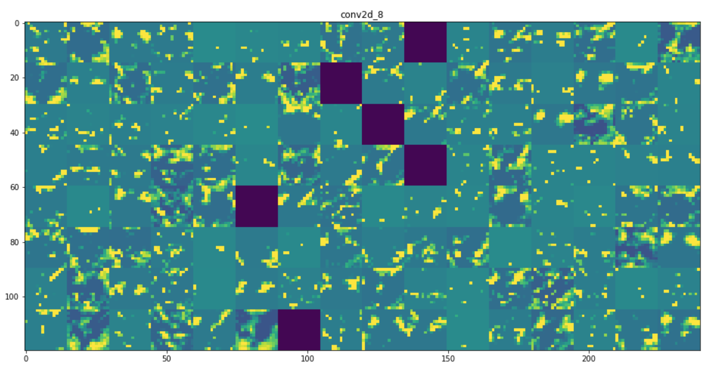
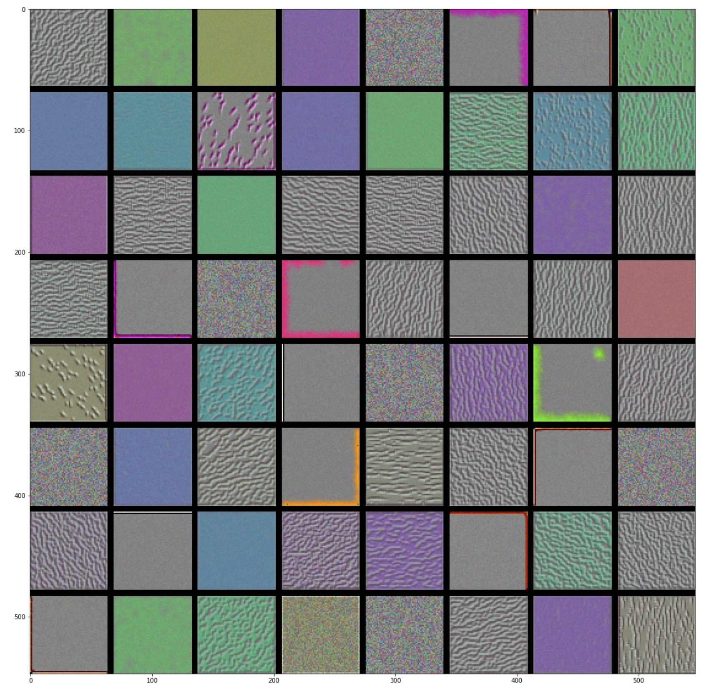

# ADS Project 5: 


#### PPT: [https://prezi.com/view/aLMlzVDt2iJCiDe1n1hn/](https://prezi.com/view/aLMlzVDt2iJCiDe1n1hn/)

Term: Fall 2018

+ Team #4
+ Projec title: Convolutional Neural Network Feature Visualization
+ Team members
	+ Li, Shilin sl4261@columbia.edu
	+ Xu, Zhengyang zx2229@columbia.edu
	+ Yang, Mingyu my2545@columbia.edu
	+ Yu, Chenghao cy2475@columbia.edu
	+ Yue, Yang yy2826@columbia.eduember 2
	
## Project summary:

We choose this project because neural networks as black box function approximators, most people are not sure how each layers are doing their jobs. 

Therefore, We want to explore what and how exactly different layers are extracting features. In this way, we will have a better understanding of different layers in CNN. 

The project has 3 parts. The 1st part we are using mnist dataset and build a straightforward 3-layer CNN. We then visualize the filtered channel from each layer. The 2nd part we are looking at practical images. The process is trained a CNN model with respected to dogs and cats classification. The goal of the visualization is exploring how the CNN is learning a cat. The 3rd part is using the popular VGG16 model and visualizing the filter in each layer. Therefore, we not only could explore the output from the CNN convolutional layer, but also get some knowlege of the CNN filters.

**MNIST Feature**

We created a basic 3-layers CNN for MNIST dataset, and visualized each layers' features. We can look at how that image activates the neurons of the first convolutional layer. We notice that each filter has learned differently to activate optimally for different features of the image. Also, as layer increases, the images which activate feature optimally will be less clear than previous layers'.


First Layer |
:-------------------------:|
|

Second Layer|
:-------------------------:|
|

Third Layer|
:-------------------------:|
|

**Learning a Cat**

* The first layer acts as a collection of various edge detectors. At that stage, the activations are still retaining almost all of the information present in the initial picture.
* As we go higher-up, the activations become increasingly abstract and less visually interpretable. They start encoding higher-level concepts such as "cat ear" or "cat eye". Higher-up presentations carry increasingly less information about the visual contents of the image, and increasingly more information related to the class of the image.
* The sparsity of the activations is increasing with the depth of the layer: in the first layer, all filters are activated by the input image, but in the following layers more and more filters are blank. This means that the pattern encoded by the filter isn't found in the input image.

We evidence a very important universal characteristic of the representations learned by deep neural networks: the features extracted by a layer get increasingly abstract with the depth of the layer. The activations of layers higher-up carry less and less information about the specific input being seen, and more and more information about the target (in our case, the class of the image: cat or dog). A deep neural network effectively acts as an information distillation pipeline, with raw data going in (in our case, RBG pictures), and getting repeatedly transformed so that irrelevant information gets filtered out (e.g. the specific visual appearance of the image) while useful information get magnified and refined (e.g. the class of the image).

conv2d_5|
:-------------------------:|
|

conv2d_6|
:-------------------------:|
|

conv2d_7|
:-------------------------:|
|

conv2d_8|
:-------------------------:|
|


**Explore Filters from VGG16**

These filter visualizations tell us a lot about how convnet layers see the world: each layer in a convnet simply learns a collection of filters such that their inputs can be expressed as a combination of the filters. This is similar to how the Fourier transform decomposes signals onto a bank of cosine functions. The filters in these convnet filter banks get increasingly complex and refined as we go higher-up in the model:

* The filters from the first layer in the model (block1_conv1) encode simple directional edges and colors (or colored edges in some cases).
* The filters from block2_conv1 encode simple textures made from combinations of edges and colors.
* The filters in higher-up layers start resembling textures found in natural images: feathers, eyes, leaves, etc.

First Layer             |  Second Layer
:-------------------------:|:-------------------------:
  |  
Third Layer             |  Forth Layer
  | 


**Conclusion**:
+ Shadow layers extract the texture and details characteristics.
+ Deeper layers extract the outline, shape and strongest features.
+ Shadow layers includes more features and also has the ability to extract the key features.
+ Comparably, the deeper the layer, the more representative of the features extracted.
+ Resolution of images decrease as the layers go deeper.


## Contribution statement:  

* Li, Shilin: Programmed the Mnist CNN model and visulize the mnist dataset on the layer base. Coded on the cat and dog classification, and write the visualization function to explore the feature extracted from each channel. Summarize the feature differences for the CNN learning process.
* Xu, Zhengyang(presenter): Trained the classification model in cats & dogs dataset. Programmed on visualizing each filter from each layer of the VGG 16 model. Coded on the heatmap in explore the contrast area when CNN is doing classification. Created the PPT and organize the presentation structure.
* Yang, Mingyu: Summerized the output feature differences and assist on the presentation.
* Yu, Chenghao: Researched on the feature visualization from various sources and provide important insight in building models and visualize the CNN output.
* Yue, Yang: Write a conclusive summary pdf of the jupiter notebook. Created the PPT and organize the presentation structure.

Following [suggestions](http://nicercode.github.io/blog/2013-04-05-projects/) by [RICH FITZJOHN](http://nicercode.github.io/about/#Team) (@richfitz). This folder is orgarnized as follows.

```
proj/
├── lib/
├── data/
├── doc/
├── figs/
└── output/
```

Please see each subfolder for a README file.
